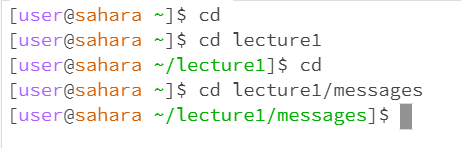
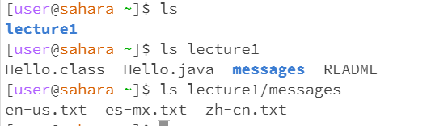
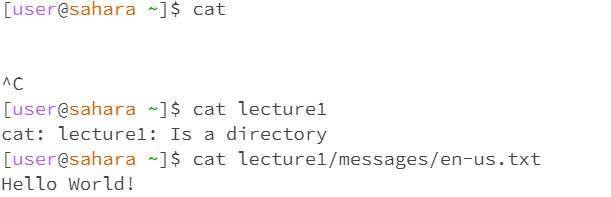

    
-No Arguments:  stays in the user  
-Path to a directory:  goes into the lecture1 repository  
- path to a file: utilizes file path to messages in lecture1 to go to messages  

   
-No Arguments: lists lecture1 as only thing in user  
-Path to a directory: lists all the things in lecture1 repository  
  path to a file: lists all the things in messages file  

  
-No Arguments:   
-Path to a directory:  
- path to a file:  
