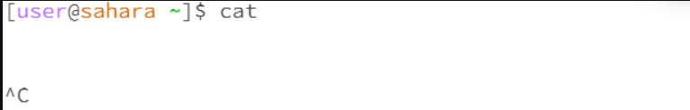

      
-No Arguments:  (current directory: user) The cd command with no arguments will change the current working directory to the current user's home directory. The current working directory was already in the user sahara, so it stays in the same directory.  
  
-Path to a directory: (current directory: user) changes current working directory from user to lecture1, which is located in user. It uses the relative file path since lecture1 is in the user directory already.   
  
-Path to a file: (current directory: user) changes current working directory from user to messages, utilizing relative file path to messages. It goes to lecture1 first, then to messages.  

     
-No Arguments: (current directory: user) output lists lecture1 as the only content in the user    
    
-Path to a directory: (current directory: user) lists all the contents in the lecture1 directory. It uses the relative file path since lecture1 is in the user directory already.     
    
-Path to a file: (current directory: user) lists all the contents in the messages file, utilizing relative file path to messages. It goes to lecture1 first, then to messages.  

     
-No Arguments: (current directory: user) cat command is used to print out the contents of a file, no subject is listed so outputs out nothing. If you type cat and press Enter, it will wait for you to provide input. Whatever you type will be echoed back to you once you press enter. If I type hello, it will echo back hello.  
     
-Path to a directory: (current directory: user) cat command outputs that lecture1 is a directory. This is an error as cat command cannot list out the contents of a directory like ls can.  
     
-Path to a file: (current directory: user) Outputs the contents of the English section of messages "Hello World!" It utilizes relative file paths to messages. It goes to lecture1 first, then to messages.  

